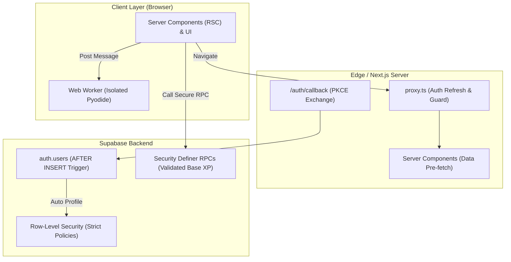

# Python Quest — Comprehensive Architectural & Code Quality Review

**Review Date:** September 2026  
**Target:** MVP Python Quest Monorepo (`apps/web`, `supabase/schema.sql`, `content/python`)  
**Stack:** Next.js 16 (App Router), React 19, TypeScript, Tailwind CSS, Supabase (Auth + PostgreSQL)

---

## Executive Summary

A comprehensive architectural, security, code quality, and accessibility review of the **Python Quest** codebase was conducted. The application demonstrates solid foundational choices—specifically:
- Clean separation between client and server Supabase clients via `@supabase/ssr`.
- Strict absence of service-role keys in browser code.
- Functional dark/light theme switching with zero initial flash.
- Clear and engaging curriculum content structured in JSON.

However, several **Critical** and **High-severity** issues exist that compromise application security, integrity of the learning progression, and code maintainability. Most urgently:
1. **Database RLS Gaps:** Core tables (`chapters`, `lessons`, `quiz_questions`, `badges`) have Row-Level Security completely disabled, exposing the entire question bank and answers to public REST inspection and unauthorized modifications.
2. **Privilege Escalation:** Column-level restrictions on `profiles` are only applied to `UPDATE` operations, leaving `INSERT` unrestricted and allowing users to award themselves unlimited XP, levels, and credits.
3. **XP Farming Exploit:** The `complete_activity` stored procedure trusts arbitrary activity keys and client-supplied XP values without validation.
4. **Client-Side Validation Flaw:** Interactive Python challenge completion relies on raw string regex testing that succeeds even when code crashes or is commented out.
5. **Architectural Duplication:** Duplicate static routes (`lesson/variables`, `lesson/decisions`, `quiz/variables`) diverge from dynamic routes (`lesson/[chapter]`, `quiz/[chapter]`), fragmenting logic and data models.

---

## Findings Overview Table

| ID | Category | Severity | Description | File Pointer |
| :--- | :--- | :--- | :--- | :--- |
| **SEC-01** | Security | **Critical** | Missing RLS on 4 core tables exposes answers & allows data tampering | [`supabase/schema.sql`](file:///c:/Users/shara/OneDrive/Documents/MVP-PythonQuest/supabase/schema.sql#L97-L99) |
| **SEC-02** | Security | **Critical** | Profile `INSERT` allows arbitrary client-side `xp`, `level`, and `credits` overwrite | [`supabase/schema.sql`](file:///c:/Users/shara/OneDrive/Documents/MVP-PythonQuest/supabase/schema.sql#L203-L223) |
| **CQ-01** | Code Quality | **Critical** | Regex challenge validation awards XP on syntax errors, crashes, or comments | [`apps/web/app/lesson/python-exercise.tsx`](file:///c:/Users/shara/OneDrive/Documents/MVP-PythonQuest/apps/web/app/lesson/python-exercise.tsx#L85-L112) |
| **SEC-03** | Security | **High** | Unvalidated activity keys in `complete_activity` allow unlimited XP farming | [`supabase/schema.sql`](file:///c:/Users/shara/OneDrive/Documents/MVP-PythonQuest/supabase/schema.sql#L153-L187) |
| **SEC-04** | Security | **High** | Full client write permissions (`FOR ALL`) on `student_badges` and `lesson_progress` | [`supabase/schema.sql`](file:///c:/Users/shara/OneDrive/Documents/MVP-PythonQuest/supabase/schema.sql#L224-L234) |
| **SEC-05** | Security | **High** | Insufficient URL sanitization in Auth Callback allows open redirect attacks | [`apps/web/app/auth/callback/route.ts`](file:///c:/Users/shara/OneDrive/Documents/MVP-PythonQuest/apps/web/app/auth/callback/route.ts#L8-L9) |
| **SEC-06** | Security | **High** | Dynamic script injection of Pyodide CDN lacks Subresource Integrity (SRI) | [`apps/web/app/lesson/python-exercise.tsx`](file:///c:/Users/shara/OneDrive/Documents/MVP-PythonQuest/apps/web/app/lesson/python-exercise.tsx#L36-L40) |
| **ARCH-01** | Architecture | **High** | Route redundancy & DRY violations across static and dynamic lesson/quiz routes | [`apps/web/app/lesson/[chapter]/page.tsx`](file:///c:/Users/shara/OneDrive/Documents/MVP-PythonQuest/apps/web/app/lesson/[chapter]/page.tsx#L12-L19) |
| **ARCH-02** | Architecture | **High** | Dashboard is entirely a Client Component, causing CLS & data fetching waterfall | [`apps/web/app/dashboard/page.tsx`](file:///c:/Users/shara/OneDrive/Documents/MVP-PythonQuest/apps/web/app/dashboard/page.tsx#L1-L42) |
| **A11Y-01** | Accessibility | **High** | Password inputs on Reset Password page lack `<label>` or accessible names | [`apps/web/app/reset-password/page.tsx`](file:///c:/Users/shara/OneDrive/Documents/MVP-PythonQuest/apps/web/app/reset-password/page.tsx#L42-L43) |
| **CQ-02** | Code Quality | **Medium** | PythonExercise hints are hardcoded to variables, showing wrong hints in chapters 2–5 | [`apps/web/app/lesson/python-exercise.tsx`](file:///c:/Users/shara/OneDrive/Documents/MVP-PythonQuest/apps/web/app/lesson/python-exercise.tsx#L23-L27) |
| **CQ-03** | Stability | **Medium** | Main-thread Pyodide execution permanently freezes browser on infinite loops | [`apps/web/app/lesson/python-exercise.tsx`](file:///c:/Users/shara/OneDrive/Documents/MVP-PythonQuest/apps/web/app/lesson/python-exercise.tsx#L85-L87) |
| **A11Y-02** | Accessibility | **Medium** | Quiz answer options lack radio group semantics and selected state indication | [`apps/web/app/quiz/[chapter]/page.tsx`](file:///c:/Users/shara/OneDrive/Documents/MVP-PythonQuest/apps/web/app/quiz/[chapter]/page.tsx#L67) |
| **A11Y-03** | Accessibility | **Medium** | `Tab` key in code editor changes browser focus rather than indenting code | [`apps/web/app/lesson/python-exercise.tsx`](file:///c:/Users/shara/OneDrive/Documents/MVP-PythonQuest/apps/web/app/lesson/python-exercise.tsx#L152) |
| **SEC-07** | Security | **Medium** | Profile creation coupled to callback fails on OAuth & disabled email verification | [`apps/web/app/auth/callback/route.ts`](file:///c:/Users/shara/OneDrive/Documents/MVP-PythonQuest/apps/web/app/auth/callback/route.ts#L24-L55) |
| **CQ-04** | Code Quality | **Medium** | Username checker lacks `AbortController`, triggering out-of-order state races | [`apps/web/app/register/page.tsx`](file:///c:/Users/shara/OneDrive/Documents/MVP-PythonQuest/apps/web/app/register/page.tsx#L27-L40) |
| **CQ-05** | Code Quality | **Medium** | Inconsistent password complexity validation between Registration and Reset | [`apps/web/app/register/page.tsx`](file:///c:/Users/shara/OneDrive/Documents/MVP-PythonQuest/apps/web/app/register/page.tsx#L12) |
| **ARCH-03** | Architecture | **Medium** | Dead UI library code: `Button` and `Card` components exist but are unused | [`apps/web/components/ui/button.tsx`](file:///c:/Users/shara/OneDrive/Documents/MVP-PythonQuest/apps/web/components/ui/button.tsx) |
| **SEC-08** | Security | **Low** | `/api/username` lacks rate limiting, allowing username harvesting & DB load | [`apps/web/app/api/username/route.ts`](file:///c:/Users/shara/OneDrive/Documents/MVP-PythonQuest/apps/web/app/api/username/route.ts) |
| **ARCH-04** | Architecture | **Low** | Uncached browser client instantiations across handlers | [`apps/web/lib/supabase/client.ts`](file:///c:/Users/shara/OneDrive/Documents/MVP-PythonQuest/apps/web/lib/supabase/client.ts) |
| **A11Y-04** | Accessibility | **Low** | Locked path items render as clickable links | [`apps/web/app/dashboard/page.tsx`](file:///c:/Users/shara/OneDrive/Documents/MVP-PythonQuest/apps/web/app/dashboard/page.tsx#L83-L91) |
| **A11Y-05** | Accessibility | **Low** | Form inputs lack `aria-describedby` linking to error text | [`apps/web/app/register/page.tsx`](file:///c:/Users/shara/OneDrive/Documents/MVP-PythonQuest/apps/web/app/register/page.tsx#L91) |
| **ARCH-05** | Architecture | **Low** | Monorepo lacks App Router boundaries (`loading.tsx`, `error.tsx`, `not-found.tsx`) | [`apps/web/app`](file:///c:/Users/shara/OneDrive/Documents/MVP-PythonQuest/apps/web/app) |
| **CQ-06** | Code Quality | **Low** | Duplicate JSX code preview block on landing page | [`apps/web/app/page.tsx`](file:///c:/Users/shara/OneDrive/Documents/MVP-PythonQuest/apps/web/app/page.tsx#L14-L18) |

---

## Detailed Findings & Remediation

### 1. Critical Severity

#### [SEC-01] Missing Row-Level Security (RLS) on Four Core Database Tables
- **File:** [`supabase/schema.sql`](file:///c:/Users/shara/OneDrive/Documents/MVP-PythonQuest/supabase/schema.sql#L97-L99)
- **Problem:**
  Lines 97–99 and line 116 enable RLS only on `profiles`, `lesson_progress`, `student_badges`, and `activity_progress`:
  ```sql
  alter table public.profiles enable row level security;
  alter table public.lesson_progress enable row level security;
  alter table public.student_badges enable row level security;
  alter table public.activity_progress enable row level security;
  ```
  The tables `public.chapters`, `public.lessons`, `public.quiz_questions`, and `public.badges` are left without RLS.
- **Risk:**
  In Supabase PostgREST, any table without RLS enabled is open for public CRUD operations according to PostgreSQL default grants. Any anonymous or authenticated user can perform:
  - `DELETE FROM public.chapters;`
  - `INSERT INTO public.quiz_questions ...;`
  - `GET /rest/v1/quiz_questions?select=question,correct_answer;`
  This enables direct vandalism of course content and trivial inspection of all quiz answers.
- **Remediation:**
  Enable RLS on all four tables and add read-only policies:
  ```sql
  alter table public.chapters enable row level security;
  alter table public.lessons enable row level security;
  alter table public.quiz_questions enable row level security;
  alter table public.badges enable row level security;

  create policy "chapters select public" on public.chapters for select using (true);
  create policy "lessons select public" on public.lessons for select using (true);
  create policy "quiz_questions select public" on public.quiz_questions for select using (true);
  create policy "badges select public" on public.badges for select using (true);

  -- Explicitly revoke write operations from anon and authenticated
  revoke insert, update, delete on public.chapters from anon, authenticated;
  revoke insert, update, delete on public.lessons from anon, authenticated;
  revoke insert, update, delete on public.quiz_questions from anon, authenticated;
  revoke insert, update, delete on public.badges from anon, authenticated;
  ```

---

#### [SEC-02] Column-Level Privilege Escalation via Profile `INSERT`
- **File:** [`supabase/schema.sql`](file:///c:/Users/shara/OneDrive/Documents/MVP-PythonQuest/supabase/schema.sql#L203-L223)
- **Problem:**
  The schema attempts to prevent clients from directly setting their own `xp`, `level`, `credits`, and `streak` by revoking `UPDATE` on `public.profiles` and granting `UPDATE` only on safe columns (lines 218–222).
  However, **`INSERT` is left completely unrestricted**:
  ```sql
  create policy "profiles insert own row"
  on public.profiles for insert
  with check (auth.uid() = user_id);
  ```
- **Risk:**
  When a user creates or upserts their profile, their `INSERT` permissions cover ALL columns. A client can execute:
  ```javascript
  await supabase.from("profiles").insert({
    user_id: user.id,
    display_name: "Hacker",
    xp: 999999,
    level: 100,
    credits: 999999,
    streak: 365
  });
  ```
  The row check `auth.uid() = user_id` evaluates to true, and the database accepts the manipulated gamification values.
- **Remediation:**
  Revoke general insert privileges on sensitive columns, or preferably initialize the profile strictly via a PostgreSQL `AFTER INSERT ON auth.users` trigger:
  ```sql
  revoke insert on public.profiles from authenticated;
  grant insert (
    user_id, username, display_name, age, email, profession,
    learner_level, grade, school_name, school_location, curriculum, learning_goal, avatar
  ) on public.profiles to authenticated;
  ```

---

#### [CQ-01] Client-Side Regex Challenge Validation Allows Solution Spoofing
- **File:** [`apps/web/app/lesson/python-exercise.tsx`](file:///c:/Users/shara/OneDrive/Documents/MVP-PythonQuest/apps/web/app/lesson/python-exercise.tsx#L85-L112)
- **Problem:**
  Challenge completion is evaluated using JavaScript regular expressions against the raw editor string:
  ```typescript
  const result = await pyodide.runPythonAsync(`...
  try:
      with contextlib.redirect_stdout(_output):
          exec(${pythonCode}, globals())
  except Exception:
      traceback.print_exc(file=_output)
  _output.getvalue()`);
  ...
  if (solutionPattern.test(code)) {
    await supabase.rpc("complete_activity", { activity: activityKey, base_xp: 50 });
  }
  ```
- **Risk:**
  1. **False Positives / Cheating:** The Python wrapper swallows all Python exceptions and writes them to string output without throwing a JS error. A student can enter a commented-out line (`# quest_xp = 50`) or invalid syntax followed by the target pattern. The code crashes, but `solutionPattern.test(code)` returns `true`, awarding XP and marking the quest complete!
  2. **False Negatives:** Valid Python solutions that compute the result dynamically (e.g. `quest_xp = int("50")` or `quest_xp = 25 * 2`) fail the regex and penalize the learner.
- **Remediation:**
  Verify the execution state in Pyodide rather than regex string matching:
  ```typescript
  // In Python execution:
  // Return structured result containing stdout, error flag, and variable values
  const runScript = `
  import contextlib, io, json, traceback
  _out = io.StringIO()
  _err = None
  try:
      with contextlib.redirect_stdout(_out):
          exec(${pythonCode}, globals())
  except Exception as e:
      _err = traceback.format_exc()
  json.dumps({
      "stdout": _out.getvalue(),
      "error": _err,
      "quest_xp": globals().get("quest_xp")
  })
  `;
  const result = JSON.parse(await pyodide.runPythonAsync(runScript));
  if (!result.error && result.quest_xp === 50) {
    // Verified valid execution
  }
  ```

---

### 2. High Severity

#### [SEC-03] Unlimited XP Farming via `complete_activity` RPC
- **File:** [`supabase/schema.sql`](file:///c:/Users/shara/OneDrive/Documents/MVP-PythonQuest/supabase/schema.sql#L153-L187)
- **Problem:**
  `complete_activity(activity text, base_xp integer)` takes an unvalidated string `activity` and client-specified `base_xp`:
  ```sql
  create or replace function public.complete_activity(activity text, base_xp integer)
  ...
  insert into public.activity_progress (user_id, activity_key)
  values (auth.uid(), activity)
  on conflict (user_id, activity_key) do nothing;
  ...
  awarded := greatest(0, base_xp - activity_row.hints_used * 5);
  update public.profiles set xp = xp + awarded ...
  ```
- **Risk:**
  Any user can open DevTools and run:
  ```javascript
  for (let i = 0; i < 500; i++) {
    await supabase.rpc('complete_activity', { activity: `farm-${i}`, base_xp: 100 });
  }
  ```
  Because `on conflict (user_id, activity_key)` only checks duplicates for the exact key, providing arbitrary new keys grants 100 XP per invocation, completely breaking the leaderboard and course progression.
- **Remediation:**
  Create an authoritative table of curriculum activities and validate the key:
  ```sql
  create table if not exists public.curriculum_activities (
    key text primary key,
    base_xp integer not null default 50
  );
  -- In complete_activity:
  select base_xp into official_xp from public.curriculum_activities where key = activity;
  if not found then
    raise exception 'invalid_activity';
  end if;
  ```

---

#### [SEC-04] Full Client Write Permissions (`FOR ALL`) on Badges and Progress
- **File:** [`supabase/schema.sql`](file:///c:/Users/shara/OneDrive/Documents/MVP-PythonQuest/supabase/schema.sql#L224-L234)
- **Problem:**
  ```sql
  create policy "progress own rows"
  on public.lesson_progress for all
  using (auth.uid() = user_id)
  with check (auth.uid() = user_id);

  create policy "badges own rows"
  on public.student_badges for all
  using (auth.uid() = user_id)
  with check (auth.uid() = user_id);
  ```
- **Risk:**
  `FOR ALL` grants `INSERT`, `UPDATE`, and `DELETE`. Any authenticated user can:
  - Insert all badges directly into `student_badges`.
  - Insert fake `lesson_progress` records marking every lesson completed with 100% quiz scores.
- **Remediation:**
  Restrict both tables to `FOR SELECT` for regular users. Write access must be restricted to trusted stored procedures or backend API routes:
  ```sql
  drop policy if exists "progress own rows" on public.lesson_progress;
  create policy "progress select own rows" on public.lesson_progress for select using (auth.uid() = user_id);

  drop policy if exists "badges own rows" on public.student_badges;
  create policy "badges select own rows" on public.student_badges for select using (auth.uid() = user_id);
  ```

---

#### [SEC-05] Open Redirect / Inadequate URL Sanitization in Auth Callback
- **File:** [`apps/web/app/auth/callback/route.ts`](file:///c:/Users/shara/OneDrive/Documents/MVP-PythonQuest/apps/web/app/auth/callback/route.ts#L8-L9)
- **Problem:**
  ```typescript
  const requestedNext = requestUrl.searchParams.get("next");
  const nextPath = requestedNext?.startsWith("/") && !requestedNext.startsWith("//") ? requestedNext : "/dashboard";
  ...
  return redirectUrl(nextPath);
  ```
- **Risk:**
  `startsWith("/") && !startsWith("//")` is insufficient. Inputs such as `/\example.com` or `/\/attacker.com` bypass this check. In modern browsers, paths beginning with `/\` are normalized to `//`, turning the URL into a protocol-relative external redirect (`https://attacker.com`).
- **Remediation:**
  Use a strict whitelist or relative URL regex:
  ```typescript
  function getSafeRedirect(next: string | null): string {
    if (!next) return "/dashboard";
    // Must begin with / followed by alphanumeric or slug characters, no backslashes or protocol-relative prefixes
    if (/^\/[a-zA-Z0-9_\-\/]+$/.test(next) && !next.startsWith("//")) {
      return next;
    }
    return "/dashboard";
  }
  ```

---

#### [SEC-06] Missing Subresource Integrity (SRI) on Pyodide CDN Script
- **File:** [`apps/web/app/lesson/python-exercise.tsx`](file:///c:/Users/shara/OneDrive/Documents/MVP-PythonQuest/apps/web/app/lesson/python-exercise.tsx#L36-L40)
- **Problem:**
  ```typescript
  const script = document.createElement("script");
  script.src = `https://cdn.jsdelivr.net/pyodide/v${PYODIDE_VERSION}/full/pyodide.js`;
  document.head.appendChild(script);
  ```
- **Risk:**
  Loading executable JavaScript directly from a third-party public CDN without an SRI hash (`integrity`) or `crossorigin="anonymous"` exposes users to supply-chain attacks. If jsDelivr is compromised or cache-poisoned, malicious code executes with access to user session cookies and auth tokens.
- **Remediation:**
  Supply the specific SRI hash for v0.27.7 or bundle the runtime locally:
  ```typescript
  script.crossOrigin = "anonymous";
  script.integrity = "sha384-..."; // Pyodide release SRI hash
  ```

---

#### [ARCH-01] Route Redundancy & DRY Violations Across Lessons and Quizzes
- **Files:**
  - [`apps/web/app/lesson/variables/page.tsx`](file:///c:/Users/shara/OneDrive/Documents/MVP-PythonQuest/apps/web/app/lesson/variables/page.tsx)
  - [`apps/web/app/lesson/decisions/page.tsx`](file:///c:/Users/shara/OneDrive/Documents/MVP-PythonQuest/apps/web/app/lesson/decisions/page.tsx)
  - [`apps/web/app/lesson/[chapter]/page.tsx`](file:///c:/Users/shara/OneDrive/Documents/MVP-PythonQuest/apps/web/app/lesson/[chapter]/page.tsx)
  - [`apps/web/app/quiz/variables/page.tsx`](file:///c:/Users/shara/OneDrive/Documents/MVP-PythonQuest/apps/web/app/quiz/variables/page.tsx)
  - [`apps/web/app/quiz/[chapter]/page.tsx`](file:///c:/Users/shara/OneDrive/Documents/MVP-PythonQuest/apps/web/app/quiz/[chapter]/page.tsx)
- **Problem:**
  The project contains both static routes (`lesson/variables`, `lesson/decisions`, `quiz/variables`) and dynamic routes (`lesson/[chapter]`, `quiz/[chapter]`).
  - In `lesson/[chapter]/page.tsx#L12-L14`, a comment notes:
    `// "variables" and "decisions" are handled by their own static routes...`
  - `quiz/variables` uses `level-quizzes.json` and activity key `variables-quiz-v2`.
  - `quiz/[chapter]` uses `quizzes.json` and activity key `${slug}-quiz-v1`.
  - `quiz/[chapter]` displays errors in green styling (`bg-emerald-50 text-emerald-800`) even on incorrect answers!
- **Remediation:**
  Delete the static route folders `lesson/variables`, `lesson/decisions`, and `quiz/variables`. Consolidate all lessons into `lesson/[chapter]/page.tsx` and all quizzes into `quiz/[chapter]/page.tsx`. Store challenge definitions and audience levels directly in `content/python/`.

---

#### [ARCH-02] Dashboard Client-Side Waterfall & Layout Shifts (SSR Candidate)
- **File:** [`apps/web/app/dashboard/page.tsx`](file:///c:/Users/shara/OneDrive/Documents/MVP-PythonQuest/apps/web/app/dashboard/page.tsx#L1-L42)
- **Problem:**
  The entire Dashboard is marked `"use client"`. It renders initial zero/loading values ("Explorer", 0 XP, Level 1, 0 streak, loading path states), then issues multiple client queries in `useEffect`.
- **Impact:**
  - Severe layout shift (CLS) as stats and user name snap in after load.
  - Slower perceived performance and unnecessary client-side bundle size.
- **Remediation:**
  Make `dashboard/page.tsx` an async Server Component:
  ```typescript
  // apps/web/app/dashboard/page.tsx
  import { createClient } from "@/lib/supabase/server";
  import { redirect } from "next/navigation";

  export default async function DashboardPage() {
    const supabase = await createClient();
    const { data: { user } } = await supabase.auth.getUser();
    if (!user) redirect("/login");

    const [{ data: profile }, { data: quizProgress }] = await Promise.all([
      supabase.from("profiles").select("display_name, xp, level, streak, credits").eq("user_id", user.id).single(),
      supabase.from("activity_progress").select("activity_key, completed").like("activity_key", "%quiz%"),
    ]);

    return (
      // Render dashboard directly with server data
    );
  }
  ```

---

#### [A11Y-01] Password Inputs on Reset Password Page Lack Accessible Labels
- **File:** [`apps/web/app/reset-password/page.tsx`](file:///c:/Users/shara/OneDrive/Documents/MVP-PythonQuest/apps/web/app/reset-password/page.tsx#L42-L43)
- **Problem:**
  ```tsx
  <input required minLength={8} type="password" value={password} onChange={(event) => setPassword(event.target.value)} placeholder="New password" autoComplete="new-password" className="quest-input" />
  <input required minLength={8} type="password" value={confirmation} onChange={(event) => setConfirmation(event.target.value)} placeholder="Confirm new password" autoComplete="new-password" className="quest-input" />
  ```
  Neither `<label>`, `aria-label`, nor `aria-labelledby` is provided.
- **Impact:**
  Violates WCAG 2.1 SC 1.3.1 (Info and Relationships) and 4.1.2 (Name, Role, Value). Screen readers announce "edit text password" without indicating what should be entered.
- **Remediation:**
  Wrap inputs in `<label>` tags with descriptive text:
  ```tsx
  <label className="block">
    <span className="field-label">New password</span>
    <input required minLength={8} type="password" ... />
  </label>
  <label className="block mt-4">
    <span className="field-label">Confirm new password</span>
    <input required minLength={8} type="password" ... />
  </label>
  ```

---

### 3. Medium Severity

#### [CQ-02] PythonExercise Hints Are Hardcoded to Variables
- **File:** [`apps/web/app/lesson/python-exercise.tsx`](file:///c:/Users/shara/OneDrive/Documents/MVP-PythonQuest/apps/web/app/lesson/python-exercise.tsx#L23-L27)
- **Problem:**
  The `hints` array is defined as a module-level constant:
  ```typescript
  const hints = [
    "A variable assignment uses the = symbol.",
    "The variable name must be quest_xp.",
    "Replace 0 with the number 50, then run your code.",
  ];
  ```
  When `PythonExercise` is mounted on Chapter 2 (Decisions), Chapter 3 (Loops), etc., clicking "Need a nudge?" displays hints instructing the user to create `quest_xp = 50`!
- **Remediation:**
  Add `hints?: string[]` to the `PythonExercise` component props and provide context-specific hints for each chapter.

---

#### [CQ-03] Main-Thread Pyodide Execution Hangs Browser on Infinite Loops
- **File:** [`apps/web/app/lesson/python-exercise.tsx`](file:///c:/Users/shara/OneDrive/Documents/MVP-PythonQuest/apps/web/app/lesson/python-exercise.tsx#L85-L87)
- **Problem:**
  `pyodide.runPythonAsync` executes directly on the main UI thread. In Chapter 3 ("Repeat Yourself"), learners write `while` loops. An accidental infinite loop (e.g. forgetting `energy -= 1`) locks the JavaScript event loop, freezing the browser tab permanently.
- **Remediation:**
  Offload Pyodide to a Web Worker (`pyodide.worker.ts`). Wrap executions with a 3-second timeout and terminate the worker if it fails to yield.

---

#### [A11Y-02] Quiz Options Lack Radio Group Semantics
- **Files:**
  - [`apps/web/app/quiz/variables/page.tsx`](file:///c:/Users/shara/OneDrive/Documents/MVP-PythonQuest/apps/web/app/quiz/variables/page.tsx#L104-L108)
  - [`apps/web/app/quiz/[chapter]/page.tsx`](file:///c:/Users/shara/OneDrive/Documents/MVP-PythonQuest/apps/web/app/quiz/[chapter]/page.tsx#L67)
- **Problem:**
  Quiz choices are plain `<button>` elements. Screen reader users are not informed that these buttons are mutually exclusive options in a single question group, nor can they detect which option is currently selected.
- **Remediation:**
  Wrap options in `<fieldset>` with `<legend>` for the prompt, or use `role="radiogroup"` with buttons having `role="radio"` and `aria-checked={selected === option}`.

---

#### [A11Y-03] Inaccessible Indentation Handling in Python Code Editor
- **File:** [`apps/web/app/lesson/python-exercise.tsx`](file:///c:/Users/shara/OneDrive/Documents/MVP-PythonQuest/apps/web/app/lesson/python-exercise.tsx#L152)
- **Problem:**
  Pressing the `Tab` key inside the `<textarea>` triggers the browser's default behavior, immediately jumping focus to the "Run code" button. Because indentation is required in Python (especially for `if`, `for`, `while`, and `def`), users cannot format code properly using the keyboard.
- **Remediation:**
  Intercept `Tab` in `onKeyDown` to insert 4 spaces at the cursor position. To comply with WCAG 2.1.2 (No Keyboard Trap), provide an escape mechanism (e.g. `Esc` key temporarily disengages Tab interception so the user can navigate away).

---

#### [SEC-07] Profile Creation Tied to Auth Callback Fails on OAuth & Direct Signups
- **File:** [`apps/web/app/auth/callback/route.ts`](file:///c:/Users/shara/OneDrive/Documents/MVP-PythonQuest/apps/web/app/auth/callback/route.ts#L24-L55)
- **Problem:**
  Profile creation is executed solely inside `/auth/callback`. If Supabase has email confirmation disabled, `signUp` logs the user in immediately and never hits `/auth/callback`. Furthermore, users clicking "Continue with Google" on the login page pass no metadata, resulting in an unconfigured profile.
- **Remediation:**
  Handle baseline profile creation via a PostgreSQL trigger:
  ```sql
  create or replace function public.handle_new_user()
  returns trigger language plpgsql security definer as $$
  begin
    insert into public.profiles (user_id, display_name, email)
    values (new.id, coalesce(new.raw_user_meta_data->>'display_name', split_part(new.email, '@', 1)), new.email)
    on conflict (user_id) do nothing;
    return new;
  end;
  $$;

  create trigger on_auth_user_created
    after insert on auth.users
    for each row execute function public.handle_new_user();
  ```

---

#### [CQ-04] Debounce Race Condition in Username Checker
- **File:** [`apps/web/app/register/page.tsx`](file:///c:/Users/shara/OneDrive/Documents/MVP-PythonQuest/apps/web/app/register/page.tsx#L27-L40)
- **Problem:**
  The `useEffect` in `RegisterPage` uses `window.setTimeout` to debounce username queries, but does not use an `AbortController`. Rapid typing can cause a slower earlier response to arrive after a faster later response, overwriting the true availability state.
- **Remediation:**
  Attach an `AbortController` to the fetch request and abort previous requests in the effect cleanup.

---

#### [CQ-05] Inconsistent Password Complexity Validation
- **Files:**
  - [`apps/web/app/register/page.tsx`](file:///c:/Users/shara/OneDrive/Documents/MVP-PythonQuest/apps/web/app/register/page.tsx#L12)
  - [`apps/web/app/reset-password/page.tsx`](file:///c:/Users/shara/OneDrive/Documents/MVP-PythonQuest/apps/web/app/reset-password/page.tsx#L18)
- **Problem:**
  `RegisterPage` enforces `/^(?=.*[A-Za-z])(?=.*\d)(?=.*[^A-Za-z\d]).{8,}$/` (letter, number, symbol, 8+ characters). In contrast, `ResetPasswordPage` only enforces `password.length >= 8`. A user can bypass registration password policies simply by requesting a reset.
- **Remediation:**
  Extract shared password validation logic into a shared module `apps/web/lib/validation.ts`.

---

#### [ARCH-03] Dead UI Library Code in `components/ui/`
- **Files:**
  - [`apps/web/components/ui/button.tsx`](file:///c:/Users/shara/OneDrive/Documents/MVP-PythonQuest/apps/web/components/ui/button.tsx)
  - [`apps/web/components/ui/card.tsx`](file:///c:/Users/shara/OneDrive/Documents/MVP-PythonQuest/apps/web/components/ui/card.tsx)
- **Problem:**
  Reusable component primitives `Button`, `Card`, `CardHeader`, and `CardContent` are defined with typed props and variants, but are never imported anywhere in the monorepo.
- **Remediation:**
  Refactor pages to use these UI primitives to guarantee visual consistency and reduce inline CSS repetition, or delete them to eliminate dead code.

---

### 4. Low Severity

#### [SEC-08] Missing Rate Limiting on `/api/username`
- **File:** [`apps/web/app/api/username/route.ts`](file:///c:/Users/shara/OneDrive/Documents/MVP-PythonQuest/apps/web/app/api/username/route.ts)
- **Problem:** The endpoint calls `is_username_available` with no rate limiting or IP-based throttling, enabling automated username enumeration and unnecessary load on the PostgreSQL connection pool.

#### [ARCH-04] Suboptimal Supabase Browser Client Instantiation
- **File:** [`apps/web/lib/supabase/client.ts`](file:///c:/Users/shara/OneDrive/Documents/MVP-PythonQuest/apps/web/lib/supabase/client.ts)
- **Problem:** `createClient()` calls `createBrowserClient` on every invocation instead of maintaining a memoized singleton instance. Multiple component renders create duplicate Supabase client objects.

#### [A11Y-04] Locked Path Items Render as Clickable Links
- **File:** [`apps/web/app/dashboard/page.tsx`](file:///c:/Users/shara/OneDrive/Documents/MVP-PythonQuest/apps/web/app/dashboard/page.tsx#L83-L91)
- **Problem:** Locked lessons are styled with `opacity: .58`, but remain clickable `<Link>` tags that navigate users to locked content. Render locked items as disabled `<div>` elements instead.

#### [A11Y-05] Form Inputs Lack `aria-describedby` Linking to Errors
- **File:** [`apps/web/app/register/page.tsx`](file:///c:/Users/shara/OneDrive/Documents/MVP-PythonQuest/apps/web/app/register/page.tsx#L91)
- **Problem:** While `aria-invalid` is present, errors are not connected to inputs via `aria-describedby`. Screen readers announce field labels but do not automatically read error feedback when an input is focused.

#### [ARCH-05] Missing App Router Boundaries (`loading.tsx`, `error.tsx`, `not-found.tsx`)
- **File:** `apps/web/app/`
- **Problem:** The app router structure contains no `loading.tsx`, `error.tsx`, or `not-found.tsx` files. Network stalls or uncaught render exceptions result in generic, unstyled browser errors.

#### [CQ-06] Duplicated Code Preview Block on Landing Page
- **File:** [`apps/web/app/page.tsx`](file:///c:/Users/shara/OneDrive/Documents/MVP-PythonQuest/apps/web/app/page.tsx#L14-L18), [`apps/web/app/page.tsx`](file:///c:/Users/shara/OneDrive/Documents/MVP-PythonQuest/apps/web/app/page.tsx#L37-L41)
- **Problem:** The exact same 15-line `<div className="code-preview">` component markup is duplicated verbatim in `HomePage`. Extract it into a `<CodePreview />` component.

---

## Architectural Recommendations



1. **Move User Initialization to Database Triggers:**
   Decouple user profile creation from HTTP callbacks. Use an `AFTER INSERT ON auth.users` trigger in PostgreSQL to ensure that every registered user (whether via email, Google OAuth, or magic link) automatically has a valid profile record created in the database with strict default values.
2. **Execute Python in an Isolated Web Worker:**
   Migrate Pyodide from the main browser thread to a dedicated Web Worker. This isolates UI performance, provides clean execution timeouts against infinite loops, and allows worker termination if learner code hangs.
3. **Consolidate Dynamic Lesson & Quiz Routes:**
   Eliminate duplicate static pages (`lesson/variables`, `lesson/decisions`, `quiz/variables`). All chapters should resolve dynamically through `lesson/[chapter]` and `quiz/[chapter]`, reading standardized data structures from `content/python/`.
4. **Adopt Shared UI Primitives & Form Abstractions:**
   Connect `apps/web/components/ui/button.tsx` and `card.tsx` to eliminate inline styling divergence, and create an accessible `<FormField>` component that handles `<label>`, `aria-invalid`, `aria-describedby`, and error display automatically.
5. **Implement Standard Next.js Error & Loading Boundaries:**
   Add root and sub-route `loading.tsx`, `error.tsx`, and `not-found.tsx` components to present consistent loading skeletons and actionable recovery states during network delays or unhandled runtime failures.
